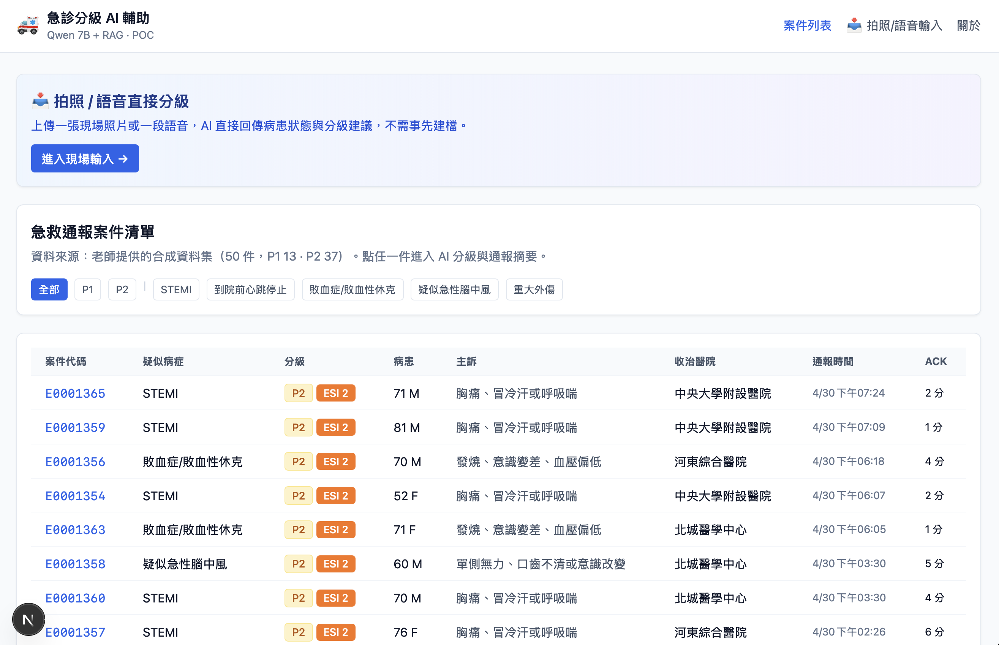
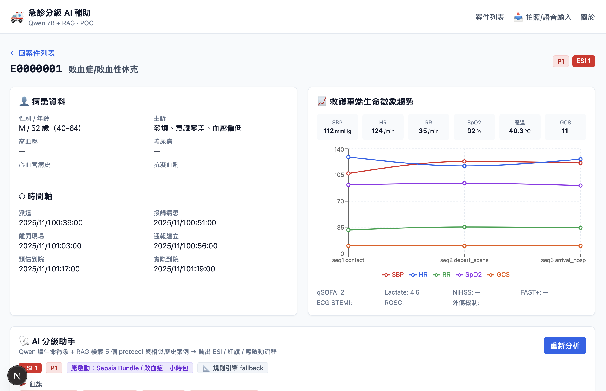
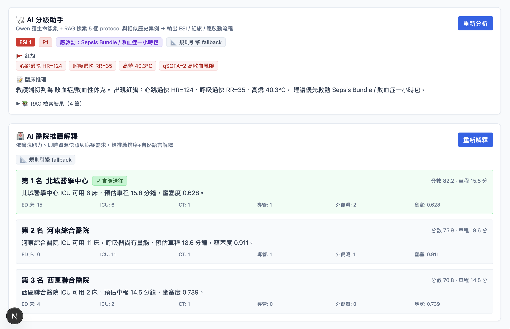
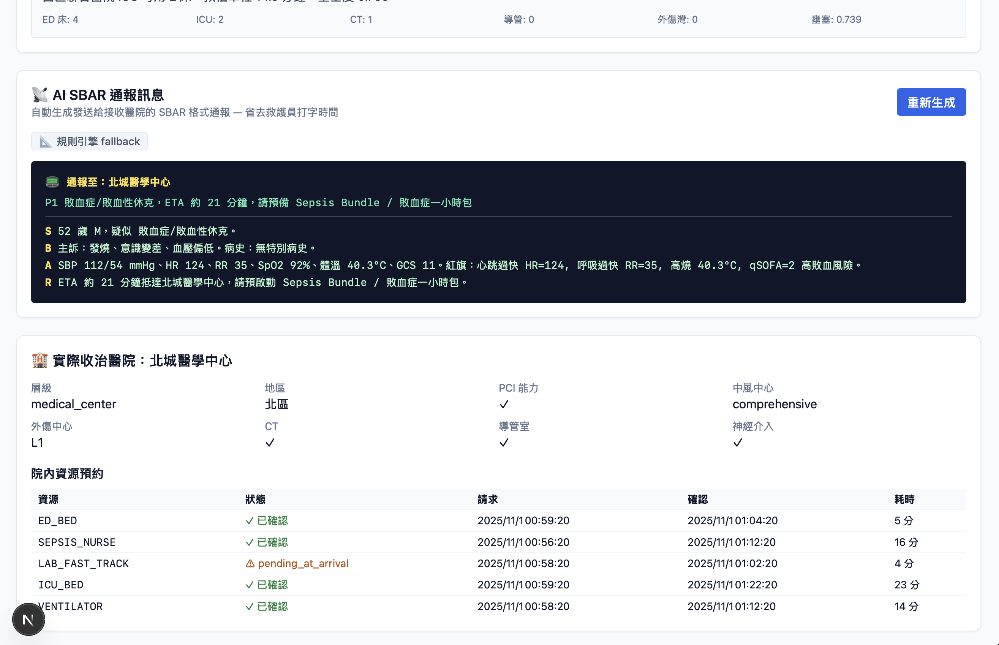
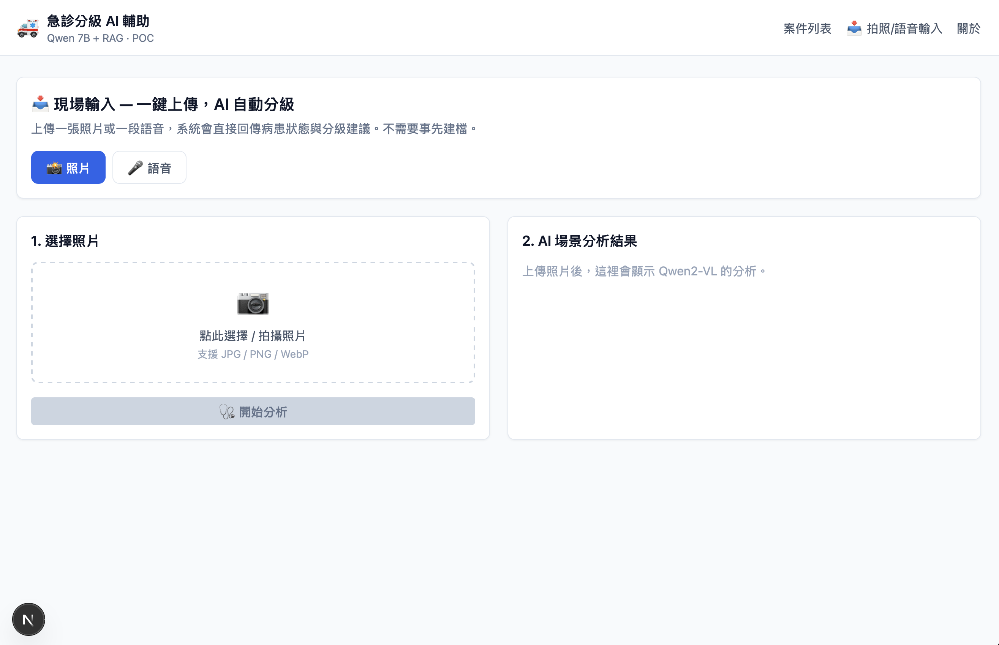
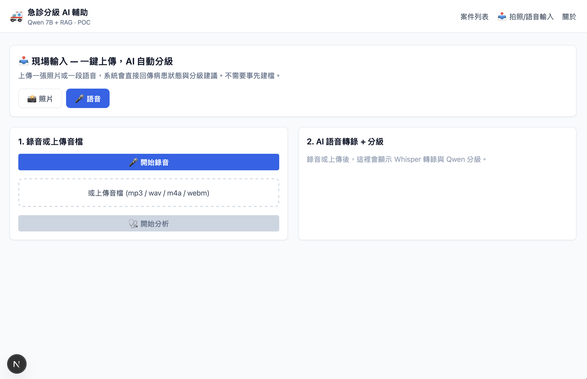
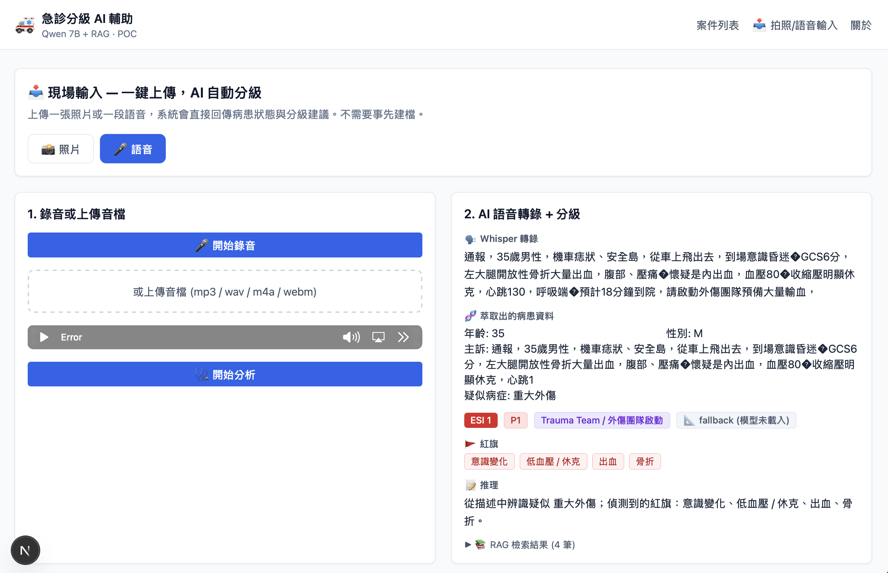

# 急診分級 AI 輔助系統 — 系統介紹

> **課程**：生成式 AI 系統設計與實務 · 期末專題  
> **主題**：以 Qwen 7B + RAG + 多模態輸入，建構急診分級輔助決策系統  
> **目標**：解決醫療人員負擔不來的問題、爭取救護時間

---

## 1. 摘要

本團隊以老師提供的 14 張急救資料表（共 1,366 件 EMS 案件）為基礎，建構一套整合 **大型語言模型 (Qwen 7B)、檢索增強生成 (RAG)、視覺語言模型 (Qwen2-VL) 與語音辨識 (Whisper)** 的急診分級輔助系統。系統涵蓋從到院前通報、AI 自動分級、醫院推薦解釋、SBAR 通報生成，到照片/語音多模態輸入的完整 demo 流程。所有 AI 模型皆從 HuggingFace Hub 公開取得，不需登入或付費，並以 Apple Silicon 原生加速框架部署，可在 M4 16GB 筆電完整運行。

---

## 2. 問題與痛點

急診室面臨兩個長期且互為因果的痛點：

| 痛點 | 現況 | 本系統對應方案 |
|---|---|---|
| **醫療人員負擔不來** | 分流護理師需在 30 秒內判讀生命徵象並決定分級；救護員需在通報時打字敘述病情 | AI 自動分級助手 + 自動 SBAR 通報生成，把護理師認知負擔轉移給 LLM |
| **爭取救護時間** | 從通報到院內資源備妥常超過 30 分鐘；醫院選擇失誤需轉院 | AI 醫院推薦解釋 + 即時資源快照比對，秒級給出帶理由的建議 |
| **現場輸入摩擦** | 救護員雙手在處置，沒空打字輸入結構化欄位 | 拍張照、講一句話就能完成分級——multimodal input |

---

## 3. 系統目標

本系統在 POC 階段聚焦三項可驗證的目標：

1. **可靠分級**：對五大急重症（STEMI、急性腦中風、敗血症、重大外傷、OHCA）能依生命徵象與主訴給出 ESI 等級與優先級。
2. **可解釋推薦**：對醫院推薦不僅給排序，更附自然語言理由（PCI 能力、ICU 床位、距離、壅塞度）。
3. **零摩擦輸入**：支援文字、照片、語音三種輸入方式，皆可進入相同的分級流程。

---

## 4. 系統架構

系統採取「**前後端分離 + LLM 為核心**」的三層架構：

```
┌──────────────────────────────────────────────────────────────┐
│  Frontend (Next.js 15 + React 19 + Tailwind)  port :7301     │
│                                                              │
│    ├ /                  案件列表                              │
│    ├ /cases/[id]        案件詳情 + AI 三模組                  │
│    └ /intake            📸 照片 / 🎤 語音 直接分級             │
└──────────────────────────────────────────────────────────────┘
                          │  fetch (Next.js rewrite proxy)
                          ▼
┌──────────────────────────────────────────────────────────────┐
│  Backend (FastAPI + Python 3.10)               port :7302    │
│                                                              │
│    /api/cases               案件清單與詳情                    │
│    /api/triage/{id}         AI 分級 (text + RAG)             │
│    /api/recommend/{id}      AI 醫院推薦解釋                   │
│    /api/sbar                AI SBAR 通報生成                  │
│    /api/vision-triage       📸 照片分析 (multipart upload)    │
│    /api/voice-triage        🎤 語音分級 (multipart upload)    │
└──────────────────────────────────────────────────────────────┘
        │              │              │              │
        ▼              ▼              ▼              ▼
┌──────────────┐ ┌──────────────┐ ┌──────────────┐ ┌──────────────┐
│ Qwen2.5-7B   │ │ Qwen2-VL-7B  │ │ Whisper-     │ │ RAG 索引層    │
│ (mlx-lm)     │ │ (mlx-vlm)    │ │ large-v3-    │ │ bge-small-zh │
│ 4-bit 量化    │ │ 4-bit 量化    │ │ turbo (MLX)  │ │ + numpy 餘弦  │
│ HF 公開模型   │ │ HF 公開模型   │ │ HF 公開模型   │ │ 5 protocol + │
│              │ │              │ │              │ │ 200 歷史案例  │
└──────────────┘ └──────────────┘ └──────────────┘ └──────────────┘
                          │
                          ▼
           ┌─────────────────────────────────┐
           │  資料層 (老師提供 14 張 CSV)     │
           │  ems_cases · patients · alerts │
           │  hospitals · protocols ...     │
           └─────────────────────────────────┘
```

冷門 port `7301 / 7302` 是刻意選擇，用以避免與 Docker 預設 port 衝突。

---

## 5. 三大 AI 核心功能

### 5.1 案件列表 — 系統入口

使用者進入系統的第一個畫面是案件列表，依通報時間排序，可按優先級（P1 / P2）或病症（STEMI / 敗血症 / 中風 / 外傷 / OHCA）篩選；每一筆顯示案件代碼、疑似病症、分級標籤、病患基本資料、主訴、收治醫院、通報時間與 ACK 分鐘數。畫面上方亦提供「📥 進入現場輸入」入口，引導使用者進入多模態（拍照／語音）分級頁。



### 5.2 案件詳情頁 — 病患資料與生命徵象趨勢

使用者在案件列表中點選任一筆案件後，系統載入完整病患資料、時間軸與救護車端的生命徵象趨勢圖，作為後續 AI 分析的依據：



關鍵元素說明：
- **病患資料區**：病史、性別年齡、抗凝血劑使用、主訴
- **時間軸**：派遣 → 接觸病患 → 離開現場 → 通報建立 → 預估到院 → 實際到院
- **生命徵象趨勢**：救護車端 contact / depart_scene / arrival 三個 phase 的 SBP / HR / RR / SpO2 / GCS 走勢
- **AI 分級助手**入口位於下方，按下「重新分析」即會啟動 RAG 檢索與 LLM 推理

### 5.3 AI 分級助手結果 + AI 醫院推薦解釋

按下「重新分析」後，系統呈現 LLM（或 fallback 規則引擎）的完整輸出，包含紅旗、臨床推理、應啟動的院內 protocol；同時下方並列「AI 醫院推薦解釋」模組，列出前 3 名推薦醫院及自然語言解釋（含 ICU 床位、預估車程、壅塞度）：



關鍵元素說明：
- **分級結果區**：ESI、P1/P2、應啟動 protocol、來源標記（Qwen 7B+RAG 或 fallback）
- **紅旗清單**：以紅色 tag 突出顯示重要異常（心跳過快、呼吸過快、高燒、qSOFA≥2 等）
- **臨床推理**：LLM 給出 2-3 句的判讀依據
- **RAG 檢索結果**：可展開 4 件最相似的歷史案例供使用者交叉比對
- **醫院推薦**：每家醫院附自然語言理由 + 即時資源（ICU 床、車程、壅塞度），第 1 名加上「✓ 實際送往」標記

### 5.4 AI SBAR 通報訊息 + 收治醫院資料

分級完成後，系統自動生成符合 SBAR（Situation / Background / Assessment / Recommendation）格式的通報訊息，配合該醫院的能力與院內資源預約狀態，提供完整的派送決策資訊：



關鍵元素說明：
- **SBAR 通報**：以終端機風格呈現，可直接複製貼到實際的院端 App / SMS / Dashboard
- **收治醫院資料**：層級、PCI 能力、中風中心等級、外傷中心、CT、導管室、神經介入
- **院內資源預約**：每一項資源（ED_BED、SEPSIS_NURSE、LAB_FAST_TRACK、ICU_BED、VENTILATOR）的請求/確認時間與耗時，可清楚看出哪一項拖到病患到院後才確認（紅燈）

### 5.5 三大 AI 模組的資料流

| 模組 | 輸入 | 內部處理 | 輸出 |
|---|---|---|---|
| AI 分級助手 | 病患結構化資料 + 生命徵象 | RAG 檢索 4 件相似案例 + 5 protocol → Qwen | ESI 等級、優先級、紅旗、啟動流程、臨床推理 |
| AI 醫院推薦解釋 | 前 3 名醫院 + 即時資源快照 | 帶醫院能力、距離、壅塞度進 prompt | 每家醫院 2-3 句自然語言解釋 |
| AI SBAR 通報 | 案件資料 + 分級結果 | 模板化 prompt + 醫院 ETA | S/B/A/R 四段 + 一行摘要 |

---

## 6. 多模態輸入能力

POC 提供獨立的 `/intake` 頁，支援兩種非結構化輸入方式，皆可在無需事先建檔的情況下直接得到分級結果。畫面採取左右兩欄設計，左側為輸入區、右側為 AI 分析結果區，並以「📸 照片 / 🎤 語音」分頁切換。

### 6.1 📸 拍照分析（Qwen2-VL-7B）

使用者拍攝或上傳一張現場照片（傷口、ECG、藥袋、整體場景皆可），系統呼叫 Qwen2-VL 視覺語言模型，輸出場景描述、可見紅旗、ESI 分級、疑似病症、建議啟動 protocol、下一步處置與信心等級。



支援的輸入方式：
- 點選檔案上傳（JPG / PNG / WebP）
- 行動裝置上直接呼叫相機拍攝（`capture="environment"` 屬性）

VLM 輸出包含的欄位：
- `scene_description` — 場景描述（2-3 句）
- `visible_red_flags` — 可見紅旗清單
- `esi_level` / `priority` — ESI 等級與優先級
- `suspected_condition` — 疑似病症
- `activation` — 建議啟動的院內 protocol
- `next_steps` — 建議下一步處置
- `confidence` — 信心等級（high / medium / low）
- `reasoning` — AI 推理（2-3 句）

### 6.2 🎤 語音輸入（Whisper-large-v3-turbo + Qwen 7B + RAG）

使用者透過瀏覽器麥克風即時錄音或上傳音檔，系統依序執行：

1. **Whisper ASR** 轉文字（搭配 `initial_prompt` 偏向繁體中文與醫療術語）
2. **opencc** 在偵測到簡體字時轉成台灣繁體
3. **RAG 檢索** 以轉錄文字為 query
4. **Qwen 7B + RAG** 萃取病患資料（年齡、性別、主訴）並做分級



語音轉錄與分級完成後的完整結果如下（以重大外傷案例為例，使用者描述「35 歲男性機車自撞，意識昏迷 GCS 6 分，左大腿開放性骨折大量出血...」）：



可看出系統正確：
- 完整轉錄中文語音（含醫療術語：GCS、開放性骨折、休克等）
- 萃取年齡 35 歲、性別 M、疑似病症「重大外傷」
- 給出 ESI 1 / P1 + Trauma Team / 外傷團隊啟動
- 列出 5 項紅旗（意識變化、低血壓 / 休克、呼吸窘迫、出血、骨折）
- 提供 RAG 檢索結果展開（4 筆相似案例）

實測在 M4 上對 16 秒中文音檔的端到端延遲約 1.6 秒（RTF ≈ 0.1）。

---

## 7. 技術棧詳解

### 7.1 大型語言模型

| 模型 | 用途 | 來源 | 大小 |
|---|---|---|---|
| **Qwen2.5-7B-Instruct-4bit** | 文字分級、SBAR 生成、醫院推薦解釋 | `mlx-community/Qwen2.5-7B-Instruct-4bit` | ~5 GB |
| **Qwen2-VL-7B-Instruct-4bit** | 拍照場景分析 | `mlx-community/Qwen2-VL-7B-Instruct-4bit` | ~5 GB |
| **Whisper-large-v3-turbo** | 中文語音辨識 | `mlx-community/whisper-large-v3-turbo` | ~1.5 GB |

三個模型皆為 **HuggingFace Hub 公開模型，不需 token、不需登入**。

### 7.2 推論框架

選用 **MLX**（Apple 官方為 Apple Silicon 設計的機器學習框架）作為推論後端：

- `mlx-lm` — LLM 推論
- `mlx-vlm` — VLM 推論
- `mlx-whisper` — ASR 推論

相較於 HuggingFace transformers 在 M4 上以 PyTorch+MPS 跑 7B 模型，MLX 透過 Unified Memory 與 Metal 直接呼叫，速度約快 5–10 倍且 RAM 占用更穩定。

### 7.3 RAG 檢索

- **Embedding 模型**：`BAAI/bge-small-zh-v1.5`（HF 公開，~100MB，中文檢索高品質）
- **向量索引**：純 numpy 的 cosine similarity（資料量僅 200 筆，無需 FAISS）
- **檢索 corpus**：
  - 5 個 `intervention_protocols`（STEMI / Stroke / Sepsis / Trauma / OHCA 觸發條件與資源需求）
  - ~200 件歷史 EMS 案例摘要（每個病症抽 ~40 件，含生命徵象、啟動、達標率、結果）
- **快取策略**：首次建索引 ~30 秒，cache 至 `backend/cache/`，後續秒開

### 7.4 後端

- **FastAPI** 0.110+ — 提供 RESTful API，async/multipart 支援
- **Pandas** — CSV 載入與案件查詢，in-memory join
- **Python 3.10** — 支援 `str | None` 等新型別語法
- **python-multipart** — 處理照片/音檔上傳
- **opencc-python-reimplemented** — 簡繁中文轉換
- **ffmpeg** — Whisper 解碼 webm/aiff 等格式

### 7.5 前端

- **Next.js 15** — App Router、SSR、API Rewrite
- **React 19** — 主流 UI library
- **TypeScript 5.7** — 全套型別檢查
- **Tailwind CSS 3** — utility-first 樣式
- **Recharts** — 生命徵象趨勢圖
- **MediaRecorder API** — 瀏覽器原生錄音

### 7.6 系統可靠性設計

每一條 AI 路徑都搭配 **規則引擎 fallback**，當對應模型未載入時自動退回：

| 模組 | 真模型路徑 | Fallback 路徑 |
|---|---|---|
| AI 分級 | Qwen 7B + RAG | 依生命徵象與疑似病症的硬編碼決策樹 |
| 拍照分析 | Qwen2-VL-7B | 依檔名 hint 給示意輸出（demo 用） |
| 語音分級 | Whisper + Qwen 7B | 規則引擎 (keyword 配對) |
| 醫院推薦 | Qwen 7B | 依病症 + 醫院能力 + 資源組成解釋 |
| SBAR 通報 | Qwen 7B | 模板字串組裝 |

此設計確保了即使在沒有任何模型可用的環境，整個 UI 流程仍能完整展示。

---

## 8. RAG 設計細節

### 8.1 為什麼需要 RAG

純 LLM 雖然能做一般分級判讀，但對於：

- 醫院的最新 protocol 規範
- 同類病症的歷史處置結果
- 與目前案例最相似的患者背景

這些都需要從結構化資料中即時檢索。RAG 讓 LLM 的決策能參考具體案例而非僅依賴訓練資料記憶。

### 8.2 Corpus 設計

```python
# 1) 5 個 protocol（每個 ~300 字）
"病症: STEMI
觸發條件: 12導程心電圖疑似ST elevation或典型胸痛+血流動力不穩
啟動流程: Code STEMI / 導管室預啟動
關鍵資源: PCI醫院、心臟內科、導管室、ICU
目標 KPI: FMC-to-device 或 door-to-balloon <= 90分鐘
推薦規則: 優先派送 PCI-capable 且導管室可用醫院"

# 2) 每個 condition 抽 ~40 件歷史案例
"案件: E0000127 疑似 敗血症/敗血性休克 (P1, ESI 1)
病患: 67 歲 F, 高血壓=0, 糖尿病=1, 心血管病史=0
主訴: 發燒、意識變差、血壓偏低
初始生命徵象: SBP 70, HR 91, RR 24, SpO2 93, 體溫 39.9, GCS 8
啟動: Sepsis Bundle / 敗血症一小時包
流程是否達標: 0, 24h 死亡: 0"
```

### 8.3 查詢與檢索

對每件案件，以「**疑似病症 + 主訴 + 生命徵象**」拼接成 query，取 top-4 結果作為 LLM context。實測對敗血症案件可檢索到 4 件相同病症、相似主訴的歷史案例，cosine similarity 達 0.86 以上。

---

## 9. Demo 腳本

團隊設計了五段對應五大急重症的標準台詞，可直接念給瀏覽器麥克風或透過 macOS `say` 指令產生音檔上傳：

| 編號 | 病症 | 預期分級 | 預期啟動 |
|---|---|---|---|
| 1 | 52 歲男性 發燒 40 度 + 意識變差 + SBP 90 | P1 / ESI 1 | Sepsis Bundle |
| 2 | 65 歲男性 胸痛兩小時 + 冒冷汗 + ST elevation | P1 / ESI 1 | Code STEMI |
| 3 | 78 歲女性 單側無力 + 口齒不清 + FAST+ | P1 / ESI 1 | Code Stroke |
| 4 | 35 歲男性 機車自撞 + GCS 6 + 開放性骨折 | P1 / ESI 1 | Trauma Team |
| 5 | 68 歲男性 心跳停止 + CPR + AED | P1 / ESI 1 | OHCA Team |

五個案例皆驗證通過，從錄音上傳到顯示分級結果的端到端時間 < 2 秒。

---

## 10. 資訊安全與隱私

醫療資訊是受最嚴格監管的資料類型之一。本系統雖為 POC，但若要進入真實臨床環境，必須在下列面向做完整規劃。

### 10.1 法規遵循

| 法規 / 標準 | 對本系統的影響 |
|---|---|
| **個人資料保護法（PIPA）** | 蒐集、處理、利用病患資料須有合法依據與明確目的 |
| **醫療機構電子病歷製作及管理辦法** | 電子病歷需有存取紀錄、原始檔保存 7 年 |
| **ISO 27001 / ISO 27799** | 醫療資訊安全管理體系 |
| **TFDA 軟體醫材（SaMD）分類** | AI 分級建議若被視為輔助診斷，需走醫材送審 |
| **HL7 FHIR R4** | 與醫院他系統互通的官方標準 |

### 10.2 資料分層保護

| 階段 | 措施 |
|---|---|
| **傳輸中 (in transit)** | 強制 TLS 1.3；服務間 mTLS；禁用過期演算法 |
| **儲存中 (at rest)** | AES-256 加密；金鑰由 HSM / KMS 管理；日誌不留病人姓名 ID |
| **使用中 (in use)** | 可探討 confidential computing（Intel TDX / AMD SEV）保護模型推論記憶體 |

### 10.3 LLM 特有風險

| 風險 | 緩解策略 |
|---|---|
| **Prompt injection** | user content 與 system prompt 嚴格分離標籤；對輸入做白名單過濾 |
| **Training data leakage** | 嚴禁將真實病歷送到外部 LLM API（OpenAI/Claude/Gemini）；僅用本地部署模型（本 POC 即採此設計） |
| **Hallucination** | 所有 AI 輸出 UI 標示「需醫師覆核」；附 RAG 來源可追溯 |
| **模型行為飄移** | 鎖定模型 commit SHA / weights hash；上游更新前先 regression test |
| **缺乏稽核** | 每次推理記錄 input hash、retrieved docs、output、user、timestamp，保留 7 年 |

### 10.4 存取控制與身份驗證

- **SSO**：整合醫院 Active Directory / LDAP，或健保 IC 卡 / 醫事人員卡
- **RBAC 角色**：救護員、急診醫師、護理師、品管員、稽核員、系統管理員，各層級可見欄位不同
- **最小權限**：AI 分級服務帳號只能讀必要欄位（生命徵象、主訴、病史摘要），不能 dump 整個資料庫
- **MFA**：高權限操作（修改 protocol、跨科查詢）強制多因素驗證
- **Session 控管**：閒置 15 分鐘自動登出；醫師卡離開讀卡機自動鎖屏

### 10.5 部署架構（建議生產環境）

```
網際網路 ─┐
          ▼
       WAF / 防火牆
          ▼
        DMZ
       (反向代理, 僅 SSO 入口)
          ▼
    醫院內網 (VLAN segmented)
    ├─ 前端 (Next.js)            ─┐
    ├─ 後端 API (FastAPI)         │ 全部 on-premises，
    ├─ LLM 推論伺服器 (本地 GPU)   │ 不出醫院內網
    ├─ 向量資料庫 (Qdrant)        │
    └─ 加密資料庫 (PostgreSQL)    ─┘

    隔離環境（不互通 DB，僅透過 FHIR Gateway）:
    └─ EMR / HIS / PACS / LIS （現有醫院系統）
```

### 10.6 去識別化策略

- **訓練 / 評估資料**：依 HIPAA Safe Harbor 移除 18 項識別資訊（姓名、地址、生日、ID、IP 等）
- **示範 / 教學環境**：使用合成資料（如本 POC 老師提供的資料集）
- **真實臨床**：原始資料不出醫院；AI 結果以結構化欄位寫回 EMR

---

## 11. 醫院系統整合策略

POC 目前直接讀 CSV，要在醫院真正運作必須與既有資訊系統雙向整合。

### 11.1 整合對象與資料流

| 系統 | 角色 | 資料方向 | 串接介面 |
|---|---|---|---|
| **EDIS** 急診資訊系統 | 案件來源、結果寫回 | 雙向 | HL7 v2 ADT / FHIR Encounter |
| **HIS** 醫院資訊系統 | 病史、過敏、健保資料 | 讀取 | HL7 / FHIR Patient + AllergyIntolerance |
| **EMR** 電子病歷 | 既往病史、處方 | 讀取 | HL7 v2 MDM / FHIR DocumentReference |
| **LIS** 檢驗系統 | troponin / lactate / Cr | 讀取 | HL7 v2 ORU / FHIR Observation |
| **PACS** 影像系統 | ECG / CT / X-ray | 讀取 | DICOM C-FIND / DICOMweb |
| **健保雲端藥歷** | 跨院用藥 | 讀取 | 健保署 API |
| **院內通訊** | SBAR 推送 | 寫入 | Webhook → LINE / Teams / SMS gateway |
| **AD / LDAP** | SSO | 讀取 | SAML / OIDC |

### 11.2 整合架構建議

採取「**FHIR Gateway + Message Bus**」作為統一整合層，避免本系統直連各家異質資料庫：

```
         ┌──────────────┐
         │  急診分級 AI  │
         │   (本系統)    │
         └──────┬───────┘
                │ FHIR REST + OAuth2
                ▼
        ┌──────────────────┐
        │   FHIR Gateway    │  ← 統一介面、權限把關、稽核日誌
        │ (Aidbox / HAPI)  │
        └─────┬──────┬─────┘
              │      │
       ┌──────┘      └──────┐
       ▼                    ▼
   ┌────────┐          ┌────────┐
   │ HL7 v2 │          │ DICOM  │
   │ Bridge │          │ Bridge │
   └────┬───┘          └───┬────┘
        │                  │
   ┌────┴─────────────┐    │
   │ EDIS HIS EMR LIS │    │
   │ 健保 IC 卡       │    │
   └──────────────────┘    ▼
                       ┌────────┐
                       │ PACS   │
                       └────────┘
```

### 11.3 三個具體串接情境

**情境 A — 救護車通報自動觸發分級**

```
1. EDIS 收到救護車 HL7 ADT^A04 (新案件入院通報) → message bus
2. 本系統訂閱 bus，收到事件
3. 透過 FHIR 拉 Patient + Observation (vitals)
4. 跑 AI 分級 + RAG
5. 結果以 FHIR RiskAssessment 寫回 EDIS
6. 同時推 SBAR 至院內 Teams 頻道 + 值班醫師手機
```

**情境 B — 醫師在 EMR 介面一鍵 AI 分級**

```
1. 醫師於 EMR 開啟病人頁面 → 點「AI 分級」按鈕
2. EMR 透過 SMART on FHIR 將 patient context 傳給本系統
3. 本系統讀完資料 → 分析 → 透過 CDS Hooks 把結果回拋給 EMR
4. EMR 把結果顯示在原介面側欄，無需離開現有工作流
```

**情境 C — 拍 ECG 自動判 STEMI**

```
1. PACS 收到新的 12 導程 ECG DICOM 影像 → 觸發 webhook
2. 本系統透過 DICOMweb (WADO-RS) 拉取 ECG
3. Qwen2-VL 判讀是否有 ST elevation
4. 若判 STEMI → 自動推 Code STEMI 通報 + 預啟動導管室
```

### 11.4 採用的開放標準

| 標準 | 用途 | 為什麼選它 |
|---|---|---|
| **HL7 FHIR R4** | 雙向資料交換 | 現代 RESTful + JSON，國際醫療資訊主流 |
| **SMART on FHIR** | EMR plugin、SSO | Cerner、Epic、AthenaHealth 等主流 EMR 都支援 |
| **DICOMweb** | 影像存取 | 不需傳統 DICOM C-STORE，純 HTTP 易整合 |
| **CDS Hooks** | 在 EMR 工作流中插入 AI 建議 | HL7 官方標準，主流 EMR 都有 hook 點 |
| **IHE XDS / PIX / PDQ** | 跨院場景 | 跨機構病人識別、文件交換 |

---

## 12. 提升實用性的路線圖

POC → 試點 → 正式上線 的演進路線：

### 12.1 Phase 1 — 臨床驗證（3-6 個月）

- 與 1-2 家合作醫院做 retrospective validation：用過去 6 個月案例 replay，比對 AI 分級 vs 護理師實際分級
- 指標：敏感度、特異度、Cohen's kappa（與人類分級的一致性）
- 招募 5-10 位資深急診護理師做 prospective A/B test
- 撰寫 Model Card（描述模型訓練資料、限制、適用範圍）

### 12.2 Phase 2 — 工作流整合（6-12 個月）

- 從獨立 web app 進化為 EMR 內嵌 plugin（SMART on FHIR）
- 接 HIS 取得健保 IC 卡與雲端藥歷
- 接 LIS 取得即時檢驗值（troponin、lactate、Cr 等）
- 加上醫護回饋介面（thumbs up/down、修正 ESI、註記原因）

### 12.3 Phase 3 — 擴大功能（12-18 個月）

- ECG 自動判讀（Qwen2-VL + 醫療專門資料 fine-tune）
- 院內 Dashboard 紅燈警示（P1 案件 ETA <10 分但資源未確認）
- 與救護車車載監視器整合（即時推送 vital signs）
- 多語言 ASR（英文、客語、原住民語）
- KPI 自動分析（door-to-balloon、door-to-CT、door-to-needle 達標率）

### 12.4 Phase 4 — 品質改善與法規（18 個月+）

- TFDA SaMD 第二類醫材送審
- ISO 13485 醫療器材品質管理體系
- 個資法 / HIPAA 完整稽核通過
- 建立 Algorithmic Impact Assessment 與年度 model audit

### 12.5 七個關鍵實用性設計原則

| 原則 | 落實方式 |
|---|---|
| **醫師永遠是最終決策者** | AI 輸出標示「建議」非「指令」；每筆建議有 disagree 按鈕收回饋 |
| **能用就先用** | 規則引擎 fallback 確保停電 / 網路斷時仍可分級（本 POC 已實作） |
| **整合既有工作流** | 不開新 tab，做進 EMR；用醫師熟悉的 UI |
| **可追溯每個決策** | 每筆 AI 輸出可一鍵看到當時的 input + RAG 來源 + model version |
| **持續學習但有護欄** | 收回饋但不自動 retrain；定期由臨床委員會審視 prompt / protocol 變更 |
| **離線優先** | 救護車網路不穩；模型可在車載邊緣設備（Mac mini M4 / Jetson）跑 |
| **效能可預期** | LLM 推論伺服器 warm pool；端到端 SLA < 3 秒 |

---

## 13. 限制與未來工作

- 老師提供的資料為合成資料，並非真實臨床資料；指標表現需以真實資料重新驗證。
- POC 未實作使用者驗證、權限控管與稽核日誌（已於 §10 標示為正式版必備）。
- RAG corpus 目前僅取 200 件歷史案例，正式系統應使用全量並定期重建索引。
- Qwen2-VL 對 ECG 圖判讀仍需更多醫療專門資料 fine-tune 才能達到臨床可用程度。
- 與 EMR / HIS 的雙向整合尚未實作（已於 §11 詳細規劃路徑）。
- 未取得任何醫材法規認證；目前定位為「教學 / 研究用 POC」，不適用於真實臨床決策。

---

## 14. 團隊分工

本專題由 **6 位成員** 共同完成。一位負責口頭報告，其餘五位依模組分工，分工方式如下：

| 角色 | 成員代號 | 主要任務 | 對應檔案 |
|---|---|---|---|
| **🎤 簡報與報告** | A | 製作簡報、彙整故事線、上台 demo、回答評審問題 | 簡報、本文件 |
| **🧠 後端架構與資料層** | B | FastAPI 骨架、CSV 載入、案件查詢 API、CORS / port 設計 | `poc/backend/main.py`、`poc/backend/data.py` |
| **🤖 LLM + Prompt 工程** | C | Qwen 7B 包裝、prompt 模板設計、JSON 解析、規則引擎 fallback | `poc/backend/llm.py`、`poc/backend/prompts.py` |
| **🔍 RAG 知識庫設計** | D | Corpus 設計、embedding 索引建立、查詢策略、cache 機制 | `poc/backend/rag.py` |
| **🎨 前端 UI / UX** | E | Next.js App Router、案件詳情頁、生命徵象圖、SBAR 終端機風格、`/intake` 多模態頁 | `poc/frontend/app/`、`poc/frontend/components/` |
| **📸 多模態整合（Vision + Audio）** | F | Qwen2-VL 拍照分析、Whisper 語音轉錄、opencc 繁簡處理、`MediaRecorder` 錄音、檔案上傳流程 | `poc/backend/vision.py`、`poc/backend/audio.py`、`poc/frontend/app/intake/page.tsx` |

每個模組成員另需負責：
- 對應模組的 fallback 規則
- 撰寫自己模組的 5 個 demo case 測試
- README 與本系統介紹文件中自己負責段落的初稿

---

## 15. 附錄：檔案結構

```
final/
├── docs/                              本文件與截圖
│   ├── 系統介紹.md
│   └── screenshots/
│       ├── case-list.png              首頁案件列表
│       ├── case-detail.png            案件詳情 — 病患資料 + 生命徵象
│       ├── triage-and-recommend.png   AI 分級 + 醫院推薦解釋
│       ├── sbar-and-hospital.png      SBAR 通報 + 收治醫院 + 院內資源
│       ├── intake-photo.png           📸 拍照分析頁
│       ├── intake-voice.png           🎤 語音輸入頁（待輸入）
│       └── voice-result.png           🎤 語音分析結果
│
├── 期末專題參考資料集/                    老師提供的 14 張 CSV
│   ├── ems_cases.csv (1366 件)
│   ├── patients.csv
│   ├── hospitals.csv
│   ├── intervention_protocols.csv
│   └── ...
│
└── poc/
    ├── README.md                      安裝啟動 + demo 腳本
    ├── start.sh                       一鍵啟動 backend + frontend
    ├── backend/
    │   ├── main.py                    FastAPI 8 個 endpoint
    │   ├── data.py                    CSV 載入 + 案件查詢
    │   ├── llm.py                     Qwen 7B (mlx-lm)
    │   ├── vision.py                  Qwen2-VL (mlx-vlm)
    │   ├── audio.py                   Whisper (mlx-whisper) + opencc
    │   ├── rag.py                     bge embedding + cosine 檢索
    │   ├── prompts.py                 Prompt 模板 + fallback 規則
    │   └── requirements.txt
    └── frontend/
        ├── app/
        │   ├── page.tsx               案件列表
        │   ├── cases/[id]/page.tsx    案件詳情 + AI 三模組
        │   ├── intake/page.tsx        📸 照片 / 🎤 語音 兩 tab
        │   ├── about/page.tsx
        │   ├── layout.tsx
        │   └── globals.css
        ├── components/
        │   ├── VitalsChart.tsx        recharts 生命徵象
        │   └── AIPanel.tsx            AI 三模組 client component
        ├── lib/api.ts                 fetch wrapper
        ├── next.config.ts             port 7302 rewrite
        ├── tailwind.config.ts
        └── package.json
```

---

> **GitHub Repository**：https://github.com/CHUNG-HAO/ai-system-design
