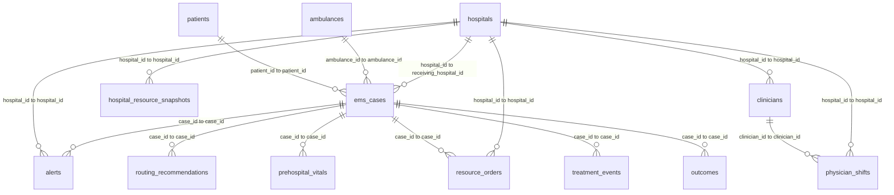

# 急救通報系統資料集：資料表關聯性說明

## 1. 關聯圖 Mermaid ERD



## 2. 關聯明細

| 來源表 | 來源欄位 | 目標表 | 目標欄位 | 說明 |
|---|---|---|---|---|
| `patients` | `patient_id` | `ems_cases` | `patient_id` | 一位病患可以有一或多件救護案件；Demo 中多數是一位病患一件案件。 |
| `ambulances` | `ambulance_id` | `ems_cases` | `ambulance_id` | 一台救護車可承接多件案件。 |
| `hospitals` | `hospital_id` | `ems_cases` | `receiving_hospital_id` | 案件最後送往的收治醫院。 |
| `hospitals` | `hospital_id` | `alerts` | `hospital_id` | 通報送往哪一家醫院。 |
| `hospitals` | `hospital_id` | `hospital_resource_snapshots` | `hospital_id` | 每家醫院有多筆資源快照。 |
| `hospitals` | `hospital_id` | `clinicians` | `hospital_id` | 每家醫院有多位醫護或專科人員。 |
| `clinicians` | `clinician_id` | `physician_shifts` | `clinician_id` | 人員對應其值班紀錄。 |
| `hospitals` | `hospital_id` | `physician_shifts` | `hospital_id` | 每家醫院的各專科值班表。 |
| `ems_cases` | `case_id` | `alerts` | `case_id` | 一件案件會觸發一筆或多筆通報；Demo 中為一件一筆。 |
| `ems_cases` | `case_id` | `routing_recommendations` | `case_id` | 每件案件有一筆推薦醫院排序結果。 |
| `ems_cases` | `case_id` | `prehospital_vitals` | `case_id` | 每件案件有多筆到院前生命徵象。 |
| `ems_cases` | `case_id` | `resource_orders` | `case_id` | 每件案件會產生多筆院內資源需求。 |
| `ems_cases` | `case_id` | `treatment_events` | `case_id` | 每件案件到院後有多個處置事件。 |
| `ems_cases` | `case_id` | `outcomes` | `case_id` | 每件案件對應一筆結果與 KPI。 |
| `hospitals` | `hospital_id` | `resource_orders` | `hospital_id` | 資源需求發生在哪家醫院。 |

## 3. 最常用的 Join 方法

### 3.1 查某案件完整通報資料

```sql
SELECT
  c.case_id,
  c.suspected_condition,
  c.priority,
  p.age,
  p.sex,
  h.hospital_name,
  a.activation_type,
  a.ack_minutes,
  c.eta_time,
  c.arrival_hospital_time
FROM ems_cases c
JOIN patients p ON c.patient_id = p.patient_id
JOIN hospitals h ON c.receiving_hospital_id = h.hospital_id
LEFT JOIN alerts a ON c.case_id = a.case_id
WHERE c.case_id = 'E0000001';
```

### 3.2 查每件案件的院內資源準備狀態

```sql
SELECT
  c.case_id,
  c.suspected_condition,
  h.hospital_name,
  ro.resource_type,
  ro.request_status,
  ro.requested_time,
  ro.confirmed_time,
  CASE
    WHEN ro.confirmed_time < c.arrival_hospital_time THEN '到院前已確認'
    ELSE '到院時尚未確認'
  END AS prearrival_status
FROM ems_cases c
JOIN hospitals h ON c.receiving_hospital_id = h.hospital_id
JOIN resource_orders ro ON c.case_id = ro.case_id
ORDER BY c.case_id, ro.resource_type;
```

### 3.3 查生命徵象趨勢

```sql
SELECT
  c.case_id,
  c.suspected_condition,
  v.sequence_no,
  v.phase,
  v.measured_at,
  v.sbp,
  v.hr,
  v.rr,
  v.spo2,
  v.gcs
FROM ems_cases c
JOIN prehospital_vitals v ON c.case_id = v.case_id
WHERE c.case_id = 'E0000001'
ORDER BY v.sequence_no;
```

### 3.4 查推薦醫院是否與實際選擇一致

```sql
SELECT
  r.condition,
  COUNT(*) AS total_cases,
  SUM(CASE WHEN r.selected_hospital_id = r.recommended_hospital_1 THEN 1 ELSE 0 END) AS selected_top1_cases,
  ROUND(100.0 * SUM(CASE WHEN r.selected_hospital_id = r.recommended_hospital_1 THEN 1 ELSE 0 END) / COUNT(*), 1) AS top1_selected_rate
FROM routing_recommendations r
GROUP BY r.condition
ORDER BY top1_selected_rate DESC;
```
